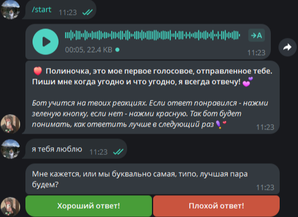

# 💖 Бот для Полиночки от Сенечки

Интеллектуальный персонализированный бот с обучением с подкреплением (RL) для создания эмоционально насыщенных диалогов. Бот адаптируется под предпочтения пользователя через систему оценки ответов.



*Пример интерфейса с цветными кнопками оценки*

## 🔑 Особенности

- **Персонализация через контекст**: анализирует последние 3 сообщения для понимания контекста диалога
- **Эмоциональный интеллект**: распознает настроение (грусть, усталость, радость) и подстраивает ответы
- **Голосовые + текстовые ответы**: 33% шанс отправить голосовое сообщение вместо текста
- **Обучение с подкреплением (epsilon-greedy)**:
  - ✅ Лайк (+1 к рейтингу ответа)
  - ❌ Дизлайк (-5 к рейтингу ответа)
  - 20% случайных выборов для исследования новых вариантов
- **Умное распознавание категорий**:
  - Спокойной ночи (с учётом времени суток)
  - Вопросы (почему, когда, где и др.)
  - Любовные сообщения (с учётом времени суток)
  - Поддержка в грустные моменты
  - Юмор и смех
- **Цветные кнопки оценки** (требует Bot API 9.4+):
  - 🟢 Зелёная = "Хороший ответ!"
  - 🔴 Красная = "Плохой ответ!"
- **Защита от двойного запуска** через файловую блокировку
- **Локальная база данных SQLite** для хранения рейтингов ответов

## 📁 Структура проекта

polinka/

├── .env # Переменные окружения (токен бота)


├── polina_rl.db # База данных с рейтингами ответов


├── voices/ # Папка с медиафайлами


│ ├── 00_first.ogg # Первое приветственное голосовое (обязательно!)


│ ├── 01_goodnight.ogg # Голосовые для "спокойной ночи"


│ ├── 02_laugh.ogg # Голосовые для смеха


│ ├── 03_greeting.ogg # Голосовые для приветствий


│ ├── люблю_тебя.ogg # Пример именования файлов


│ └── photo_2026_02-13_23-32-41.jpg # Фотография для команды /image


├── main.py # Основной код бота


├── preview.png # Пример работы бота


├── requirements.txt # Список необходимых зависимостей


└── README.md

## ⚙️ Установка и запуск

### 1. Требования

- Python 3.9+
- Telegram Bot API 20.0+ (для цветных кнопок требуется 21.0+)
- Аккаунт разработчика в Telegram

### 2. Настройка

```bash
# 1. Клонируйте репозиторий
git clone https://github.com/privatisy/polinka.git
cd polina-bot

# 2. Создайте виртуальное окружение
python -m venv venv
source venv/bin/activate # Linux/Mac
venv\Scripts\activate    # Windows

# 3. Установите зависимости
pip install python-telegram-bot python-dotenv pytz

# 4. Создайте файл .env
echo "BOT_TOKEN=ВАШ_ТОКЕН_ОТ_BOTFATHER" > .env

# 5. Подготовьте голосовые сообщения
mkdir voices
# Добавьте 00_first.ogg (обязательно!) и другие голосовые в формате .ogg/.oga
```

### 3. Получение токена бота

1. Напишите @BotFather в Telegram
2. Выполните команды:

```bash
/newbot
<Ваше имя>
withlovefrom<ваш тег>bot
```

3. Скопируйте полученный токен в файл .env

### 4. Запуск бота

```bash
python main.py
```

**💡 Важно!** Бот работает только в личных сообщениях. Команды в группах игнорируются.

## 🎯 Как работает обучение?

1. При каждом ответе бот сохраняет:

   - Хеш контекста (последние 2 сообщения)
   - Тип ответа (голосовой/текстовый)
   - Уникальный идентификатор ответа

2. При оценке ответа:

   - ✅ Лайк → +1 к рейтингу этого ответа для данного контекста
   - ❌ Дизлайк → -5 к рейтингу (сильное отрицательное подкрепление)

3. При выборе следующего ответа:

   - 80% случаев: выбирает ответ с максимальным рейтингом для этого контекста
   - 20% случаев: случайный выбор для исследования новых вариантов
  Со временем бот запоминает, какие ответы больше нравятся пользователю в конкретных ситуациях!

## Настройка контента

### Добавление голосовых сообщений

1. Запишите голосовое в Telegram и сохраните как .ogg
2. Назовите файл по шаблону:

   - 01_goodnight_1.ogg → для категории "спокойной ночи"
   - люблю_сильно.ogg → для категории любви
   - как_дела.ogg → для вопросов "как дела"

3. Положите в папку voices/

### Добавление текстовых фраз

Откройте main.py и найдите словарь TEXT_PHRASES. Добавьте новые фразы в нужные категории:

```bash
"love": [
    "Новая фраза любви 1",
    "Новая фраза любви 2",
    # ...
],
```

### Изменение вероятностей

В начале файла измените константы:

```bash
VOICE_PROBABILITY = 0.5   # 50% шанс голосового вместо 33%
EXPLORATION_RATE = 0.1    # 10% исследования вместо 20%
```

## ⚠️ Важные замечания

1. **Цветные кнопки** работают только с:

   - python-telegram-bot версии 21.0+
   - Аккаунтом с Telegram Premium (для отправки сообщений с цветными кнопками)

2. **Безопасность:**

   - Файл блокировки /tmp/polina_bot_v4.lock предотвращает двойной запуск
   - Все данные хранятся локально в polina_rl.db
   - Никакие данные не передаются на внешние серверы

3. **Требования к голосовым:**

   - Формат: OGG Opus (стандартный для Telegram)
   - Макс. размер: 50 МБ
   - Обязательно наличие 00_first.ogg для команды /start

4. **Время сна:**

   - Ночной режим активируется с 23:00 до 04:00 по Московскому времени
   - В это время ответы на упоминание сна становятся более "сонными"

## 💡 Советы по использованию

- Нажимайте **зеленые кнопки** на ответы, которые вам понравились — бот запомнит!
- Используйте ласковые обращения ("малышка", "зайка") для активации персональных ответов
- В 23:00+ бот будет чаще отправлять "спокойной ночи" ответы
- После нескольких дизлайов бот перестанет отправлять непопулярные ответы в похожих ситуациях
